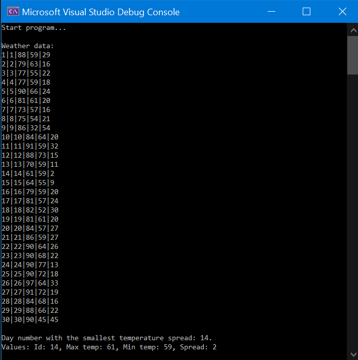
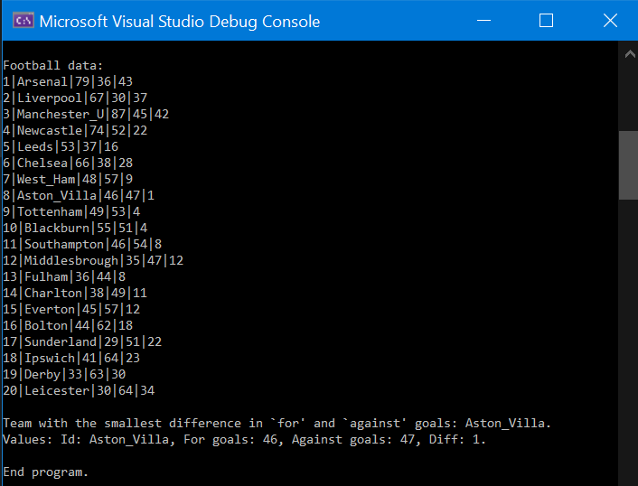

DataMunging Solution

This .NET 6 C# console app is a solution to a coding challenge.
- Two text-based data files are provided. The files contain different subject matter and different column layouts.
- For each row containing data, two numeric column values are extracted.
- The difference between these values is calculated and compared among all the data items. 
- The data item with the smallest difference is identified and displayed. Though there is the possibility more than one item may meet the criteria, the challenge only specifies one item be displayed.

# Solution Architecture
- One purpose of this challenge is demonstrate application of the DRY principle; that is, to utilize as much common code as possible when extracting data from data files with different content and different column layouts.
- As such, the common objects and methods shared between the data extractions are:
    - class DataItem
    - enum DataType
    - method CommonService.GetFileData
    - method CommonService.ReadLines
    - method DisplayData

- Only these methods are not shared, to handle the differences between the content and column layouts.
    - method DataService.GetWeatherItem
    - method DataService.GetFootballItem
 
# How to Build
1. Clone the repository and open the destination folder.
2. Using Visual Studio, open the solution file: `DataMunging.sln`
3. Build and run the application.

# Sample Output (screenshots)
First, the Weather column values extracted from the file `Weather.dat` are displayed, along with the difference between the values.
Below this data, the day number with the smallest temperature spread is displayed.

Next, the Football column values extracted from the file `Football.dat` are displayed, along with the difference.
Below this data, the team with the smallest difference in For and Against goals is displayed.

